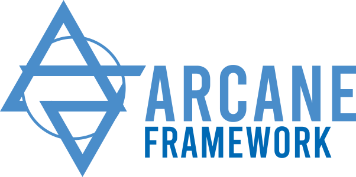

[//]: <> (Comment: -*- coding: utf-8-with-signature -*-)

Written by CEA/IFPEN and Contributors

(C) Copyright 2000-2024 CEA/IFPEN. All rights reserved.

All content is the property of the respective authors or their employers.

For more information regarding authorship of content, please consult the listed source code repository logs.
____

  
  
Development platform for unstructured 2D or 3D parallel computing codes.

Arcane is a development environment for parallel numerical calculation codes. It supports the architectural aspects of a calculation code, such as data structures for meshing and parallelism, as well as more environment-related aspects such as dataset configuration.
____

Table of Contents:
- [Documentation](#documentation)
  - [User documentation](#user-documentation)
  - [Developer documentation](#developer-documentation)
  - [Alien documentation](#alien-documentation)
- [Changelog](#changelog)
- [Key features](#key-features)
- [Getting started](#getting-started)
  - [Compiling and/or installing Arcane](#compiling-andor-installing-arcane)
    - [Docker images](#docker-images)
    - [Spack](#spack)
- [Examples of how to use the Arcane Framework](#examples-of-how-to-use-the-arcane-framework)
  - [Arcane Benchs](#arcane-benchs)
  - [Sharc](#sharc)
  - [ArcaneFem](#arcanefem)
  - [MaHyCo](#mahyco)
- [Rencontres Arcane](#rencontres-arcanes)
- [Screenshots](#screenshots)

# Documentation

The documentation is available online and is generated and stored in this [GitHub repository](https://github.com/arcaneframework/arcaneframework.github.io).

## User documentation

This documentation is intended for Arcane users.

- [User documentation (French)](https://arcaneframework.github.io/arcane/userdoc/html/index.html)
- User documentation (English) (Soon)

## Developer documentation

This documentation is intended for Arcane developers.

- [Developer documentation (French)](https://arcaneframework.github.io/arcane/devdoc/html/index.html)
- Developer documentation (English) (Soon)

## Alien documentation

This documentation is intended for Alien users and developers.

- [Alien documentation](https://arcaneframework.github.io/framework/aliendoc/html/index.html)

# Changelog

The changelog is available [in the documentation](https://arcaneframework.github.io/arcane/userdoc/html/da/d0c/arcanedoc_news_changelog.html) 
or [in this repository](arcane/doc/doc_common/changelog.md).

# Key features

  
<strong>Massively parallel</strong>

  - Work on simple laptop or on a supercomputer (run case on more than 100k CPU core)
  - Domain partitioning with message-passing (MPI, Shared Memory or hydrid MPI/Shared Memory)
  - Unified Accelerator API (experimental)
    - CUDA
    - ROCM
    - SYCL (experimental)
    - oneTBB (experimental)
  - Basic support for explicit vectorization
  - Automatic Load Balancing with cell migration with several mesh partitioner
    - ParMetis
    - PTScotch
    - Zoltan

  
<strong>I/O</strong>

  - Supported input mesh file type:
    - VTK Legacy (2.0 and 4.2)
    - VTK VTU
    - [Lima](https://github.com/LIHPC-Computational-Geometry/lima)
    - MED
    - xmf
    - Gmsh (4.1)
  - Post-processing with the following supported output file type:
    - VTKHDF (V1 and V2)
    - Ensight7Gold
  - Time history curves
  - Support for checkpoint/restarting for long simulation

  
<strong>Mesh entities</strong>

  - Multiple mesh entities (items) are usable in Arcane:
    - Node (0D), Edge (1D), Face and Cells
    - Particle
    - DoF (Degree of freedom)
  - Full Connectivities between items (cell to node, node to edge, ...)
  - Support for user connectivities
  - Easy-to-use Arcane mesh variables on any kind of item
    - double, Int32, Int64, ..
    - Scalar, 1D, 2D or multi-dim
    - and many more...
  - Several kind of meshes are supported (1D, 2D and 3D)
    - unstructured
    - unstructured with adaptative refinement
    - cartesian (experimental)
    - cartesian with patch refinement (AMR) (experimental)
    - polyedral mesh (any number of edges/faces per cell)
  - Meshes are fully dynamic (adding/removing cells)
  - All the connectivities and variables are usable on accelerators

  
<strong>Multi-constituents support</strong>

  - Two levels of constituents (environment and materials)
  - Any cell variable may have values par constituant

  
<strong>Performance and Verification and Validation</strong>

  - Bit-to-bit comparison for Arcane variables
  - Between-synchronizations comparing
  - Unit test system integration
  - Automatic profiling of loops using accelerator API
  - Automatic profiling with sampling using Papi library or signal using SIGPROF
  - Automatic use of CUDA CUPTI library to track unified memory (USM) moves between host and device

  
<strong>Decoupled and extensible framework</strong>

  - Handling of case options via a descriptor file based on XML (axl files)
  - Automatic generation of documentation
  - Notion of Service (plugin) with separated interface/implementation to extend functionalities
  - Notion of independant Modules to enable modularity
  - Limited usage of C++ templates to make extensibility easier

  
<strong>Extensions to other langages</strong>

  - Most of the classes are available in C#
  - Python wrapping (work in progress, available at end of 2024)

  
<strong>Algebraic manipulation</strong>

  - Use of Alien library to handle linear systems
  - Coupling with several linear solver libraries
    - Hypre
    - Trilinos
    - PETSc

  
<strong>Other functionalities</strong>

  - Standalone mode to use only some functionalities of Arcane
    - mesh connectivities
    - accelerator API
  - Handling of time loop with automatic support to go back to a previous iteration

# Getting started

## Compiling and/or installing Arcane

To compile the Arcane Framework, you need an x86 or ARM64 CPU, Linux OS or Windows OS and a C++
compiler with a version that supports C++20 or higher.

For all other dependencies and more information, check out the 
[Compiling/Installing](https://arcaneframework.github.io/arcane/userdoc/html/d7/d94/arcanedoc_build_install.html)
guide.

  
Click here if the documentation is not available

To prepare your computer :

- [Ubuntu 24.04](arcane/doc/doc_common/chap_build_install/subchap_prerequisites/_ubuntu24.md)
- [Ubuntu 22.04](arcane/doc/doc_common/chap_build_install/subchap_prerequisites/_ubuntu22.md) and [CMake instructions](arcane/doc/doc_common/chap_build_install/subchap_prerequisites/snippets/_cmake.md)
- [Ubuntu 20.04](arcane/doc/doc_common/chap_build_install/subchap_prerequisites/_ubuntu20.md) and [CMake instructions](arcane/doc/doc_common/chap_build_install/subchap_prerequisites/snippets/_cmake.md)
- [AlmaLinux/RedHat 9](arcane/doc/doc_common/chap_build_install/subchap_prerequisites/_rh9.md) and [CMake instructions](arcane/doc/doc_common/chap_build_install/subchap_prerequisites/snippets/_cmake.md)
- [ArchLinux based](arcane/doc/doc_common/chap_build_install/subchap_prerequisites/_arch.md)

To build and install Arcane:
- [Compiling/Installing](arcane/doc/doc_common/chap_build_install/2_build.md)

### Docker images

Docker images with the Arcane framework installed are available in this 
[GitHub repository](https://github.com/arcaneframework/containers/pkgs/container/arcane_ubuntu-2204).
More information [here](https://github.com/arcaneframework/containers).

### Spack

Spack recipes for Arcane are available [here](https://github.com/arcaneframework/spack_recipes).

# Examples of how to use the Arcane Framework

An introductory chapter with the construction of a Hello world is
available [here](https://arcaneframework.github.io/arcane/userdoc/html/db/d53/arcanedoc_examples.html).

Examples of applications using Arcane are available on GitHub. 
Here is a non-exhaustive list:

## [Arcane Benchs](https://github.com/arcaneframework/arcane-benchs)

A set of mini-applications to evaluate Arcane functionalities. These are a good basis for getting 
started with Arcane.

## [Sharc](https://github.com/arcaneframework/sharc)

Arcane-based application for solving different geosciences problems.

## [ArcaneFem](https://github.com/arcaneframework/arcanefem)

Very simple codes to test Finite Element Methods using Arcane.

## [MaHyCo](https://github.com/cea-hpc/MaHyCo)

Finite volume code for solving hydrodynamic equations:
Lagrangian or Eulerian simulations.

# Rencontres Arcane

The next Rencontres Arcane are scheduled on Monday, the 24th March, 2025.

  
  
Les Rencontres Arcane on March 24th 2025.

The previous presentations are stored [here](https://github.com/arcaneframework/events).

# Screenshots

  
  
Transient elastodynamics with ArcaneFEM

  
<strong>More Screenshots from ArcaneFEM</strong>

  
  
Aerodynamics

  
  
Bilaplacian

  
  
Linear elasticity

  
  
Electrostatics

  
  
Solving Fourier equation

  
  
Solving Laplace equation

  
  
Solving Poisson equation

  
  
Water concentration in a porous material with Sharc

  
<strong>More Screenshots from Sharc</strong>

  

  
  
Evolution of water concentration over time in a porous material

