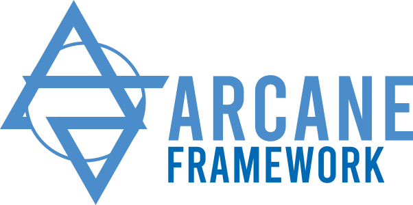
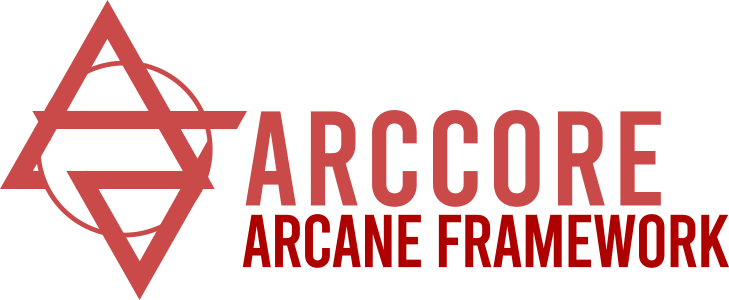
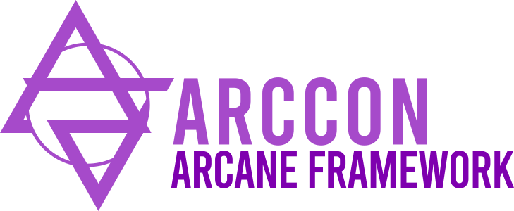
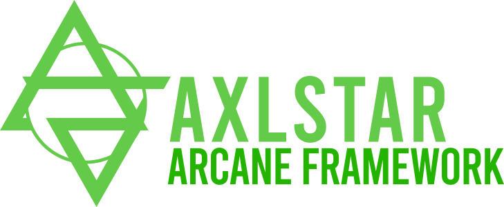
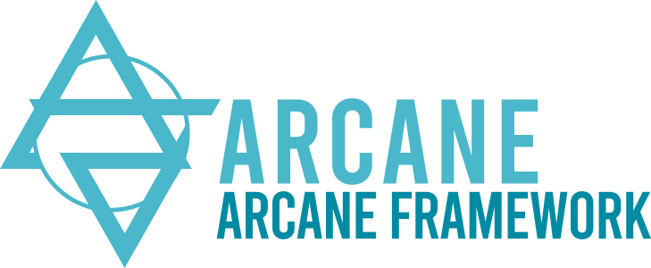

[//]: <> (Comment: -*- coding: utf-8-with-signature -*-)

Written by CEA/IFPEN and Contributors

(C) Copyright 2000-2023 CEA/IFPEN. All rights reserved.

All content is the property of the respective authors or their employers.

For more information regarding authorship of content, please consult the listed source code repository logs.
____

  
  
Plateforme de développement pour les codes de calcul parallèles non structurés 2D ou 3D.

- [Documentation](#documentation)
- [Changelog](#changelog)
- [Getting started](#getting-started)
  - [Installer Arcane](#installer-arcane)
  - [Exemples d'utilisation de la plateforme Arcane](#exemples-dutilisation-de-la-plateforme-arcane)
- [Introduction au framework Arcane](#introduction-au-framework-arcane)
  - [Arccore](#arccore)
  - [Arccon](#arccon)
  - [AxlStar](#axlstar)
  - [Arcane](#arcane)

## Documentation
La documentation en ligne est accessible depuis internet :
- La documentation utilisateur se trouve ici : [Documentation utilisateur](https://arcaneframework.github.io/arcane/userdoc/html/index.html)
- La documentation développeur se trouve ici : [Documentation développeur](https://arcaneframework.github.io/arcane/devdoc/html/index.html)
- Le dépôt GitHub où est générée et stockée la documentation : [Dépôt GitHub](https://github.com/arcaneframework/arcaneframework.github.io)

## Changelog
Les dernières modifications sont dans le fichier suivant: [Changelog](arcane/doc/doc_common/changelog.md)

## Getting started
### Installer Arcane
Les instructions pour compiler et installer Arcane sont [ici](BUILD.md).

Des images Docker sont aussi disponibles [ici](https://github.com/arcaneframework/containers/pkgs/container/arcane_ubuntu-2204).
Les détails concernant ces images sont [ici](https://github.com/arcaneframework/containers).

Des recettes Spack pour Arcane sont accessibles [ici](https://github.com/arcaneframework/spack_recipes).

### Exemples d'utilisation de la plateforme Arcane
Des exemples d'applications utilisant Arcane sont disponibles sur GitHub. En voici une liste non-exaustive :
- [Benchs Arcane](https://github.com/arcaneframework/arcane-benchs) : Un lot de mini-applications permettant d'évaluer
  des fonctionnalités d'Arcane. Ce sont de bonnes bases pour débuter dans Arcane.
- [ArcaneFem](https://github.com/arcaneframework/arcanefem) : Very simple codes to test Finite Element Methods using Arcane.
- TODO MaHyCo

## Introduction au framework Arcane
Ce dépôt Git contient quatre parties : Arccore, Arccon, AxlStar et Arcane.

### Arccore
<a href="https://github.com/arcaneframework/framework/tree/main/arccore">
  

  (Plus de détails ici)
</a>

TODO

### Arccon
<a href="https://github.com/arcaneframework/framework/blob/main/arccon/build-system/README.md">
  

  (Plus de détails ici)
</a>

Arccon fournit des fonctions CMake pour gérer les packages classiques ainsi que les cibles CMake associées.

Son objectif est de proposer une abstraction pour gérer les packages de manière uniforme en fonction des versions de CMake et de la manière dont est installé le produit afin de ne pas avoir à modifier les fichiers CMake de l'application.

### AxlStar
<a href="https://github.com/arcaneframework/framework/blob/main/axlstar">
  

  (Plus de détails ici)
</a>

Axlstar est un ensemble d'outils pour générer à partir de fichier XML au format axl des classes C++ pour créer
des services ou des modules pour la plateforme Arcane.

### Arcane
<a href="https://github.com/arcaneframework/framework/blob/main/arcane">
  

  (Plus de détails ici)
</a>

Arcane est le composant qui se place au dessus de tous les autres.
