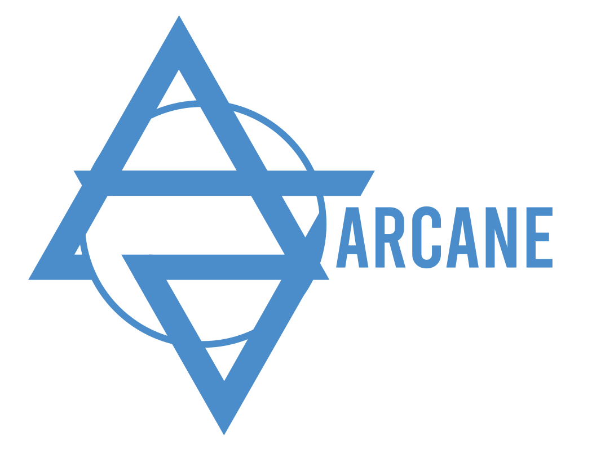

[//]: <> (Comment: -*- coding: utf-8-with-signature -*-)


# 


Written by CEA/IFPEN and Contributors

(C) Copyright 2000-2023 CEA/IFPEN. All rights reserved.

All content is the property of the respective authors or their employers.

For more information regarding authorship of content, please consult the listed source code repository logs.

## Introduction

Arcane est une platforme de développement pour les codes de calcul parallèles non structurés 2D ou 3D.

## Compilation et installation

### Pré-requis

Un compilateur supportant le C++17 est requis :

- GCC 7+
- Clang 6+
- Visual Studio 2019 (version 16.8+)

Si on souhaite utiliser l'API accélérateur, un compilateur supportant le
C++20 est requis. Les versions minimales des compilateurs classiques sont:

- GCC 11+
- Clang 15+
- Visual Studio 2022 (version 17.4+)

Les outils et bibliothèques suivants sont requis:

- [CMake 3.21+](https://cmake.org) (ou 3.26+ pour le support de CUDA)
- [.Net Core 6+](https://dotnet.microsoft.com/download)
- [GLib](https://www.gtk.org/)
- [LibXml2](http://www.xmlsoft.org/)

Les outils et bibliothèques suivants sont optionnels mais fortement recommandés:

- IntelTBB 2018+ pour le support du multi-threading
- MPI (implémentation MPI 3.1 nécessaire)

Les outils et bibliothèques suivants sont optionnels:

- [Swig 4.0+](http://swig.org/)
- [HDF5 1.10+](https://www.hdfgroup.org/solutions/hdf5/)

### Compilation

La compilation d'Arcane se fait obligatoirement dans un
répertoire distinct de celui des sources. On note `${SOURCE_DIR}` ce
répertoire contenant les sources et `${BUILD_DIR}` le répertoire de compilation.

Arcane dépend de `Arccon`, `Arccore` et `Axlstar`. Il est nécessaire d'avoir accès
aux sources de ces produits pour compiler. Les variables CMake
`Arccon_ROOT`, `Arccore_ROOT` et `Axlstar_ROOT doivent respectivement
pointer vers les sources de ces produits.

Si `${INSTALL_PATH}` est le répertoire d'installation, les commandes
suivantes permettent de compiler et installer Arcane

~~~{.sh}
mkdir ${BUILD_DIR}
cd ${BUILD_DIR}
cmake -S ${SOURCE_DIR} -DCMAKE_INSTALL_PREFIX=${INSTALL_PATH} -DArccon_ROOT:PATH=... -DAxlstar_ROOT:PATH=... -DArccore_ROOT:PATH=...
cmake --build ${BUILD_DIR}
cmake --build ${BUILD_DIR} --target install
~~~

Par défaut, l'installation se fait dans `/usr/local` si l'option
`CMAKE_INSTALL_PREFIX` n'est pas spécifiée.

Par défaut, tous les packages optionnels sont détectés
automatiquement. Il est possible de supprimer ce comportement et de
supprimer la détection automatique des packages en ajoutant
`-DARCANE_NO_DEFAULT_PACKAGE=TRUE` à la ligne de commande. Dans ce
cas, il faut préciser explicitement les packages qu'on souhaite avoir
en les spécifiant à la variable `ARCANE_REQUIRED_PACKAGE_LIST` sous
forme de liste. Par exemple, si on souhaite avoir uniquement `HDF5` et
`LibUnwind` de disponible, il faut utilise CMake comme suit:

~~~{.sh}
cmake -DARCANE_NO_DEFAULT_PACKAGE=TRUE -DARCANE_REQUIRED_PACKAGE_LIST="LibUnwind;HDF5"
~~~

### Support des accélérateurs

Depuis la version 3.12 de Arcane, le support des accélérateurs nécessite un
compilateur supportant le C++20. Il est donc nécessaire de compiler
Arcane en spécifiant la variable CMake `-DARCCORE_CXX_STANDARD=20`.

La variable CMake `ARCANE_ACCELERATOR_MODE` permet de spécifier le
type d'accélerateur qu'on souhaite utiliser. Il y a actuellement deux
valeurs supportées:

- `CUDANVCC` pour les GPU NVIDIA
- `ROCMHIP` pour les GPU AMD

##### Compilation CUDA

Il est nécessaire d'avoir au moins la version 12 de
[CUDA](https://developer.nvidia.com/cuda-downloads).

Si on souhaite compiler le support CUDA, il faut ajouter l'argument
`-DARCANE_ACCELERATOR_MODE=CUDANVCC` à la configuration et spécifier
le chemin vers le compilateur `nvcc` via la variable CMake
`CMAKE_CUDA_COMPILER` ou la variable d'environnement `CUDACXX`:

~~~{.sh}
cmake -DARCANE_ACCELERATOR_MODE=CUDANVCC
-DCMAKE_CUDA_COMPILER=/usr/local/cuda-11/bin/nvcc \
-DARCCORE_CXX_STANDARD=20 \
...
~~~

Il est aussi possible d'utiliser directement le compilateur du [HPC
SDK](https://developer.nvidia.com/hpc-sdk) de NVidia:

~~~{.sh}
export CXX=`which nvc++`
export CC=`which nvc`
cmake -DARCANE_ACCELERATOR_MODE=CUDANVCC \
-DARCCORE_CXX_STANDARD=20 \
...
~~~

Il est possible de spécifier une architecture cible (Capability
Compute) via la variable `CMAKE_CUDA_ARCHITECTURES`, par exemple
`-DCMAKE_CUDA_ARCHITECTURES=80`.

##### Compilation AMD ROCM/HIP

Pour compiler pour les GPU AMD (comme par exemple les GPU MI100 ou
MI250) il faut avoir auparavant installer la bibliothèque [ROCM](https://docs.amd.com/). Lors
de la configuration de Arcane, il faut spécifier
`-DARCANE_ACCELERATOR_MODE=ROCMHIP`.

Par exemple, si ROCM est installé dans `/opt/rocm` et qu'on souhaite
compiler pour les cartes MI250 (architecture gfx90x):

~~~{.sh}
export ROCM_ROOT=/opt/rocm-5.0.0-9257
export CC=/opt/rocm/llvm/bin/clang
export CXX=/opt/rocm/llvm/bin/clang++
export CMAKE_HIP_COMPILER=/opt/rocm/hip/bin/hipcc

cmake -DCMAKE_PREFIX_PATH="/opt/rocm;/opt/rocm/hip" \
-DARCANE_ACCELERATOR_MODE=ROCMHIP \
-DCMAKE_HIP_ARCHITECTURES=gfx90a \
-DARCCORE_CXX_STANDARD=20 \
...
~~~

### Génération de la documentation

La génération de la documentation n'a été testée que sur les plateforme Linux.
Elle nécessite l'outil [Doxygen](https://www.doxygen.nl/index.html).

Si `ARCANEDOC_OFFLINE=ON`, l'outil Doxygen a besoin d'une installation de
[LaTeX](https://www.latex-project.org/) pour générer correctement
certaines équations.

Suivant les plateformes, il peut être nécessaire
d'installer des packages LaTeX supplémentaires (par exemple pour
Ubuntu, le package `texlive-latex-extra` est nécessaire).

Pour la configuration, deux options facultatives sont disponibles :
- `ARCANEDOC_LEGACY_THEME`
- `ARCANEDOC_OFFLINE`

Avec chaqu'une deux valeurs possibles : `ON` et `OFF`.

Si les variables ne sont pas présentes, `OFF` est la valeur par défaut.

Exemple :
```bash
cmake
  -S ... \
  -B ... \
  -DARCANEDOC_LEGACY_THEME=ON \
  -DARCANEDOC_OFFLINE=ON
```
L'option `ARCANEDOC_LEGACY_THEME` permet de générer la documentation
avec le thème d'origine de Doxygen.

L'option `ARCANEDOC_OFFLINE` permet de dire à CMake que la documentation
sera utilisée en local, sans accès à internet. Cela permet de désactiver
les élements ayant besoin d'un accès à internet, comme MathJax. 

Une fois la configuration terminée, il suffit de lancer:

Pour la documentation utilisateur:

~~~{.sh}
cmake --build ${BUILD_DIR} --target userdoc
~~~

Pour la documentation développeur

~~~{.sh}
cmake --build ${BUILD_DIR} --target devdoc
~~~

La documentation utilisateur ne contient les infos que des classes
utiles pour le développeur.

### Compilation et tests des exemples

La page [Exemples](./samples_build/samples/README.md) explique comment
récupérer, compiler et exécuter les exemples.
